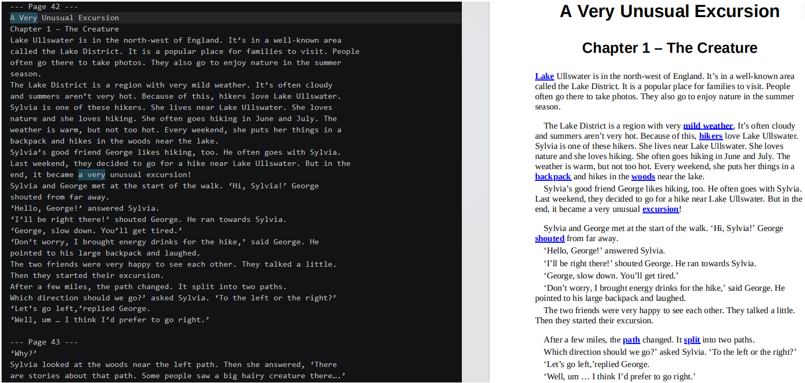
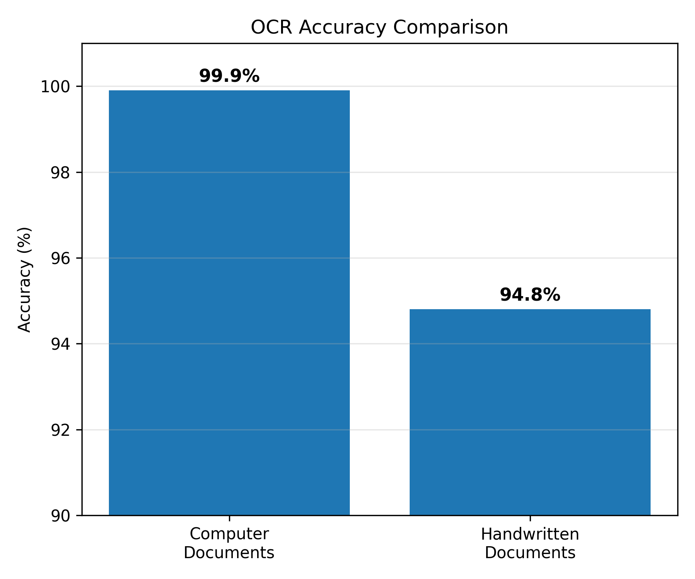
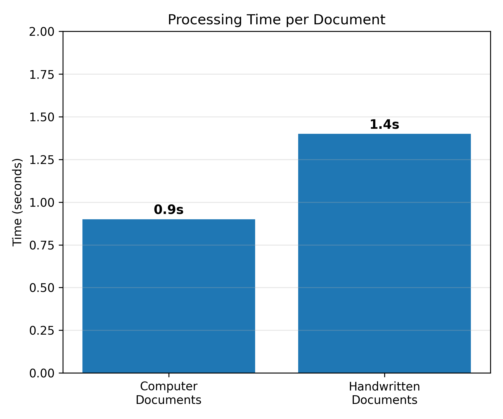

# Document Text Extractor

## About

Document Text Extractor is a Python-based OCR application designed to extract editable text from scanned documents in multiple formats, including PDF, Word, JPG, PNG, and more.

The application combines image preprocessing techniques with Optical Character Recognition (OCR) to improve text extraction quality and accuracy, making it suitable for both printed and scanned documents.

It is designed for students, researchers, businesses, and anyone who needs to convert scanned documents into searchable and editable text quickly and efficiently.

---

## Demo



---

## Features

- 📄 Extract text from scanned documents using OCR.
- 📁 Supports multiple file formats, including PDF, Word, JPG, PNG, and more.
- 📝 Export extracted text directly or save it as a `.txt` file.
- 🖼️ Image preprocessing to improve OCR quality and accuracy.
- 🎯 High text extraction accuracy for both printed and scanned documents.
- ⚡ Fast and easy-to-use interface.
- 🌍 Supports multiple languages.

---

## Tech Stack

- **Python** – Core programming language
- **OpenCV** – Image preprocessing
- **PaddleOCR** – Optical Character Recognition (OCR)
- **NumPy** – Image and array processing
- **Pillow (PIL)** – Image loading and manipulation
- **python-docx** – Reading Word documents
- **PySide6** – Graphical User Interface (GUI)

---

## Results

Below are performance results of the application.

**Accuracy**





---

## Installation

1. Clone the repository

```bash
git clone https://github.com/yasin-azadi/pdf-to-text-ocr.git
```

2. Navigate to the project directory

```bash
cd pdf-to-text-ocr
```

3. Create a virtual environment (optional but recommended)

**Windows**

```bash
python -m venv .venv
.venv\Scripts\activate
```

**Linux / macOS**

```bash
python3 -m venv .venv
source .venv/bin/activate
```

4. Install the required dependencies

```bash
pip install -r requirements.txt
```

---

## Usage

Run the application:

```bash
python main.py
```

---

## Limitations

- GPU is currently required. CPU-only support is under development.
- OCR accuracy may decrease when processing documents with poor handwriting.
- Very low-quality, blurry, or noisy images may produce inaccurate results.
- For the best performance, use clear, high-resolution scans or images.
- Straight (non-rotated) documents are recommended. Skewed or heavily tilted images may reduce OCR accuracy.
- Better input quality generally leads to better OCR results.

---

## License

This project is licensed under the MIT License. See the `LICENSE` file for details.
